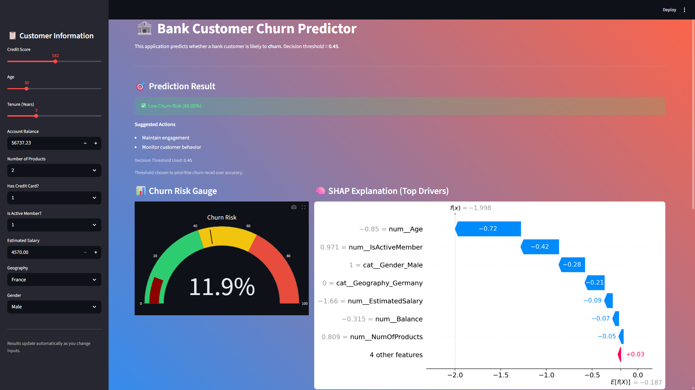
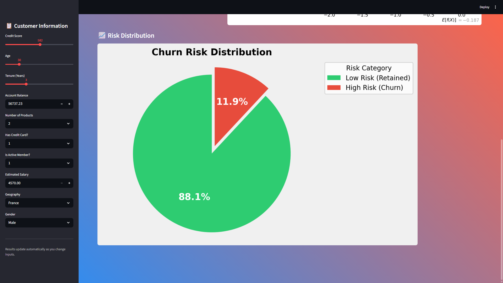

# 🏦 Bank Customer Churn Prediction

### End-to-End Machine Learning Project with Explainable AI & Interactive Dashboard

---

## 📌 Business Problem

Customer churn is a critical challenge for banks and fintech companies.
Acquiring new customers is significantly more expensive than retaining existing ones.

**Objective:**
Predict whether a bank customer is likely to **churn (leave the bank)** using historical customer data, enabling proactive retention strategies.

**Business Value:**

* Identify high-risk customers early
* Reduce revenue loss
* Enable targeted retention campaigns
* Improve customer lifetime value

---

## 🎯 Machine Learning Objective

This project demonstrates a **production-oriented churn prediction pipeline**:

* Perform **EDA** to identify churn drivers
* Build an **interpretable baseline model (Logistic Regression)**
* Handle **class imbalance** using class weights
* Optimize **decision threshold** for business impact
* Explain predictions using **SHAP**
* Deploy model via **Streamlit dashboard**

This is a **binary classification problem**:

* `1` → Customer churned
* `0` → Customer retained

---

## 📊 Dataset Overview

* **Source:** Kaggle – Bank Customer Churn Dataset
* **Records:** ~10,000 customers
* **Target Variable:** `Exited`
* **Class Distribution:**

  * Retained: ~79.6%
  * Churned: ~20.4% (moderate imbalance)

### Key Features

* Demographics: Age, Gender, Geography
* Financials: Balance, Credit Score, Salary
* Behavior: Active member, number of products, tenure

---

## 🔍 Exploratory Data Analysis (EDA)

Key insights discovered during EDA:

* Older customers are significantly more likely to churn
* Inactive members show much higher churn risk
* Customers from **Germany** churn more frequently
* High account balance correlates with churn
* Female customers show higher churn rates

These findings guided feature selection and modeling strategy.

---

## 🧠 Model Architecture & Workflow

```
Raw Customer Data
        │
        ▼
Exploratory Data Analysis
        │
        ▼
Feature Engineering
        │
        ▼
Train / Test Split (Stratified)
        │
        ▼
Preprocessing Pipeline
(StandardScaler + OneHotEncoder)
        │
        ▼
Logistic Regression Model
        │
        ▼
Class Weighting (Imbalance Handling)
        │
        ▼
Threshold Optimization
        │
        ▼
Model Explainability (SHAP)
        │
        ▼
Streamlit Interactive Dashboard
```

---

## 📈 Models Implemented

### 1️⃣ Baseline Logistic Regression

* Industry-standard model for churn
* Fast, interpretable, reliable
* Accuracy: **~80.8%**
* ROC-AUC: **~0.77**
* Limitation: Low recall for churned customers

---

### 2️⃣ Logistic Regression with Class Weights

* Applied `class_weight='balanced'`
* Improved recall for churn class
* Better aligned with business goals

## 🔁 Cross-Validation (Model Robustness Check)

To validate that the model performance is not dependent on a single train–test split, we performed **5-fold Stratified Cross-Validation** using **ROC-AUC** as the evaluation metric.

**Results:**
- Mean ROC-AUC: **~0.77**
- Standard Deviation: **~0.01**

The low variance across folds indicates that the model generalizes well and is stable across different data splits, strengthening confidence in its production readiness.

---

### 3️⃣ Threshold Optimization (Final Model)

Instead of using the default **0.5** cutoff:

* Evaluated precision–recall tradeoffs
* Selected **threshold = 0.45**

📌 **Reason:**
In churn prediction, **missing a churner is more costly** than falsely flagging a loyal customer.

---

## 📊 Final Model Performance (Threshold = 0.45)

| Metric            | Value     |
| ----------------- | --------- |
| Accuracy          | ~75%      |
| Precision (Churn) | ~0.42     |
| Recall (Churn)    | **~0.64** |
| F1-Score (Churn)  | ~0.51     |
| ROC-AUC           | ~0.77     |

### Business Interpretation

* Correctly identified **~64% of churned customers**
* Acceptable trade-off between precision and recall
* Model optimized for **customer retention strategy**

---

## 🧠 Model Explainability (SHAP)

SHAP was used to:

* Explain **individual predictions**
* Identify **global churn drivers**

Top churn contributors:

* Age
* Activity status
* Geography
* Balance
* Number of products

This ensures transparency and trust in predictions.

---

## 🖥️ Streamlit Dashboard

The project includes a **fully interactive Streamlit application**:

### Key Features

* Real-time churn probability prediction
* Recall-optimized decision logic
* Churn risk gauge visualization
* SHAP waterfall explanation per customer
* Risk distribution pie chart
* Business-oriented recommendations

### UI Preview





---

## 📁 Project Structure

```
BANK-CUSTOMER-CHURN/
│
├── DATA/
│   └── Churn_Modelling.csv
│
├── validation
|   └── cv_results.json
|
├── bank_customer_churn.ipynb
│
├── cross_validation.ipynb
│
├── artifacts/
│   └── churn_model.pkl
│
├── app.py                 # Streamlit application
├── requirements.txt
├── README.md
├── .gitignore
│
└── assets/
    ├──DASHBOARD-GAUGE,SHAP.png
    └──RISK_DISTRIBUTION.png

```

---

## ⚙️ Tech Stack

* **Language:** Python
* **Data Analysis:** Pandas, NumPy
* **Visualization:** Matplotlib, Seaborn, Plotly
* **Modeling:** Scikit-learn (Logistic Regression)
* **Explainability:** SHAP
* **Deployment:** Streamlit
* **Model Serialization:** Joblib

---

## ▶️ How to Run the Project

### 1️⃣ Clone the Repository

```bash
git clone https://github.com/SAHIL254/bank-customer-churn-prediction.git
cd bank-customer-churn-prediction
```

### 2️⃣ Create & Activate Virtual Environment

```bash
python -m venv venv
```

**Windows**

```bash
venv\Scripts\activate
```

**Mac/Linux**

```bash
source venv/bin/activate
```

### 3️⃣ Install Dependencies

```bash
pip install -r requirements.txt
```

### 4️⃣ Run Streamlit App

```bash
streamlit run app.py
```

---

## 📝 Key Engineering Decisions

* Used **stratified split** to preserve churn ratio
* Avoided data leakage using pipeline preprocessing
* Optimized threshold for **business cost**, not accuracy
* Cached model & SHAP explainer for performance
* Designed UI for non-technical stakeholders

---

## 🔮 Future Enhancements

* Gradient Boosting / XGBoost
* Cost-sensitive learning
* Automated retraining pipeline
* Cloud deployment (AWS / GCP)
* CRM system integration

---

## 👤 Author

**Sahil Dervankar**
B.Tech – Computer Science (AI/ML)
Aspiring Machine Learning Engineer

---

